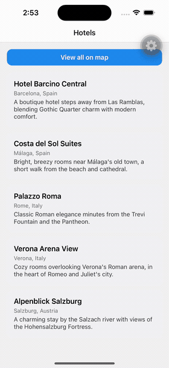

# Hotels

A mobile app for discovering hotels on an interactive map, built as a
portfolio project to demonstrate mobile app development end-to-end — from UI
to geolocation to (eventually) a real backend.

**What it does:** browse a list of hotels, tap one to fly to it on the map,
and (planned) find hotels near your current location or search by city.

## Why this project

This is a hands-on sample of my mobile development work — a real,
runnable app rather than a slide deck. It's built the way I'd approach a
production feature: a phased roadmap, working software at every step, and
decisions documented as they're made (see `plan.md` and `docs/`).

## Tech stack

- **React Native + Expo (SDK 57)** — cross-platform app (iOS, Android, web)
  from a single TypeScript codebase.
- **Expo Router** — file-based navigation, with a native (Liquid Glass on
  iOS) bottom tab bar and a search tab.
- **MapLibre GL** — open-source, vector-tile maps (via
  [OpenFreeMap](https://openfreemap.org/)) — no paid API keys required.
- **[`hotels-api`](../hotels-api)** (a sibling repo) — a NestJS backend
  with an OpenAPI-documented REST API. Currently serves mocked hotel data
  (no database or auth wired up yet — see that repo's README for the
  reasoning).
- **openapi-typescript + openapi-fetch + TanStack Query** — the app
  consumes the backend through a fully typed pipeline: OpenAPI spec →
  generated TS types → typed fetch client → domain wrappers → query hooks.
  Nothing hand-duplicates the API's shape.
- **TypeScript** in strict mode throughout (both repos).
- **ESLint + Prettier** (format-on-save via Zed) for code quality/style.
- **bun** as the package manager and script runner in both repos.
- Planned: **PostgreSQL + PostGIS** behind `hotels-api` for real geospatial
  queries, plus geolocation and city search on the client (see `plan.md`).

## Project status

Actively in progress. Current phase: hotel list, map, and a native tab bar
(Explore / Map / My Bookings / Search), all backed by a real NestJS API
over HTTP instead of a local array — though that API still serves mocked
data with no database or auth behind it yet. Next up: wiring `hotels-api`
to a real PostgreSQL + PostGIS database, then "find hotels near me" and
city search on the client. See `plan.md` for the full roadmap and
`docs/logs/` for a running log of design decisions.

## About me

Hi, I'm Tymoteusz.
I'm a full-stack developer working across frontend, backend, and user experience.
I build native mobile apps, backend APIs, and work with databases.
I'm looking for an opportunity to keep growing as a software engineer.
